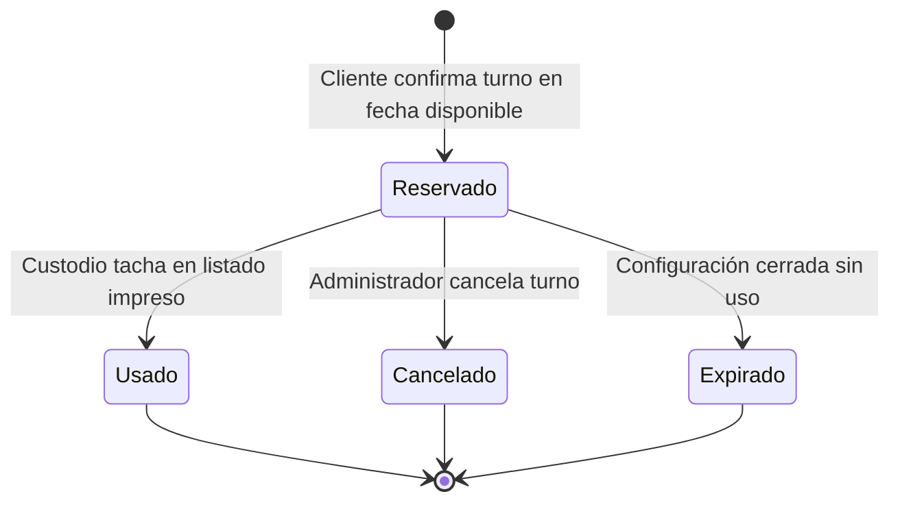

Every turn in SGR-Turnos is represented by a `Turno` entity that moves through a well-defined set of states from the moment a client confirms their reservation to the moment it is either used, cancelled, or lapsed. Understanding these transitions is essential for administrators managing daily operations, auditing outcomes, and interpreting frequency-block behaviour.

## State Diagram



## EstadoTurno Values

The `EstadoTurno` enum (`src/Enum/EstadoTurno.php`) defines five values. The `Turno` entity stores the active value in the `estado` column (varchar 20), defaulting to `RESERVADO` on construction.

| Value | Label | Who Triggers It | Effect |
|---|---|---|---|
| `RESERVADO` | Reservado | System — when the client confirms via `POST /procesar-turno` or `POST /cliente-datos/procesar` | The turn is active and counts against the client's frequency check. The associated `ConfiguracionDiaria.tickets_restantes` has already been decremented. |
| `USADO` | Usado | Admin — via `Turno::marcarComoUsado(Usuario)` called from the backoffice | Records `fecha_uso` and the acting `marcado_por` user. **Activates the frequency block** for the client's CI: `FrecuenciaService` will now compute a `fecha_desbloqueo` from `configuracion_diaria.fecha + servicio.dias_bloqueo`. |
| `CANCELADO` | Cancelado | Admin — via `Turno::cancelar()` | Sets `estado = CANCELADO`. Does **not** release a ticket back to the configuration, and does **not** trigger a frequency block for the client. |
| `CADUCADO` | Caducado | System — for turns that lapsed without action | Defined in the enum but not triggered by any of the currently implemented entity methods (`marcarComoUsado`, `cancelar`, `expirar`). Reserved for future scheduled-command use. |
| `EXPIRADO` | Expirado | System — via `Turno::expirar()` when a `ConfiguracionDiaria` is closed | Set when the configuration's `estado` moves to `CERRADA` while the turn is still `RESERVADO`. The turn is considered void — the client will need to reserve a new turn on a future available day. Does **not** trigger a frequency block. |

<Note>
  Only the `USADO` transition activates the frequency block. A `CANCELADO` or `EXPIRADO` turn has no effect on the client's ability to reserve a future turn for the same service.
</Note>

## Turn Entity Fields

The `Turno` entity (`src/Entity/Turno.php`) carries the following tracking fields relevant to its lifecycle:

| Field | Type | Description |
|---|---|---|
| `numero_turno` | `string(10)` | Unique sequential identifier within a configuration. See uniqueness guarantee below. |
| `estado` | `EstadoTurno` | Current lifecycle status. Defaults to `RESERVADO`. |
| `fecha_reserva` | `datetime` | Set automatically by the constructor to `new \DateTime()` at the moment the entity is created. |
| `fecha_uso` | `datetime` (nullable) | Set by `marcarComoUsado()` to `new \DateTime()` when the turn is consumed. `null` for all other states. |
| `marcado_por` | `Usuario` (nullable) | The admin user who called `marcarComoUsado()`. `null` until the turn is used. |
| `ip_registro` | `string(45)` (nullable) | The raw IPv4 or IPv6 address of the public terminal that created the turn, captured via `$request->getClientIp()`. This is the unmasked IP stored directly on the `Turno` entity. The separate `auditoria.ip_origen` field uses HMAC-SHA256 anonymization — `ip_registro` does not. |
| `monto_permitido` | `decimal(10,2)` | The authorised withdrawal amount copied from `configuracion_diaria.limite_por_persona` at booking time (or entered by the client for `listado_unico` services). |
| `observaciones` | `string(255)` (nullable) | Free-text field for admin notes. |

## `numero_turno` Uniqueness Guarantee

The database enforces two composite unique constraints on the `turno` table:

- `uk_turno_configuracion_numero` on `(configuracion_diaria_id, numero_turno)` — prevents duplicate turn numbers within the same daily configuration.
- `uk_turno_configuracion_cliente` on `(configuracion_diaria_id, cliente_id)` — prevents the same client from holding two turns in the same daily configuration.

For turns without a `configuracion_diaria` (i.e. `listado_unico` services), both `configuracion_diaria_id` values are `NULL`. Because `NULL ≠ NULL` in SQL unique constraints, the system uses `getNextNumeroTurnoByServicioYFecha()` — which queries all turns for the service on the given date regardless of configuration — and relies on application-level duplicate detection rather than the database constraint.

At the database level, an additional composite index `idx_turno_configuracion_numero` on `(configuracion_diaria_id, numero_turno)` accelerates the lookup used by `getNextNumeroTurnoWithLock()` during the pessimistic-lock turn assignment inside the retryable transaction.

## Transition Details

### `RESERVADO` → `USADO`

The custodian physically crosses the client's CI off the printed roster. An admin then locates the turn in `/admin/turnos/hoy` and triggers the mark-as-used action. `Turno::marcarComoUsado(Usuario $usuario)` sets `estado`, `fecha_uso`, and `marcado_por` in a single call:

```php
public function marcarComoUsado(Usuario $usuario): self
{
    $this->estado = EstadoTurno::USADO;
    $this->fechaUso = new \DateTime();
    $this->marcadoPor = $usuario;
    return $this;
}
```

After the flush, `FrecuenciaService::getFechaDesbloqueo()` will return a non-null date for this client/service combination, blocking new reservations until `configuracion_diaria.fecha + dias_bloqueo` days have elapsed.

### `RESERVADO` → `CANCELADO`

An admin cancels the turn via `Turno::cancelar()`. No ticket is returned to the `ConfiguracionDiaria` (the counter was already decremented at reservation time), and no frequency block is activated. The client is free to attempt a new reservation immediately.

```php
public function cancelar(): self
{
    $this->estado = EstadoTurno::CANCELADO;
    return $this;
}
```

### `RESERVADO` → `EXPIRADO`

When an admin closes a `ConfiguracionDiaria` (changes its `estado` to `CERRADA`), any remaining `RESERVADO` turns for that configuration are marked `EXPIRADO` via `Turno::expirar()`. No frequency block is triggered, and the client's ability to book another day is unaffected.

```php
public function expirar(): self
{
    $this->estado = EstadoTurno::EXPIRADO;
    return $this;
}
```

### `CADUCADO` (Reserved for Future Use)

The `CADUCADO` state is defined in `EstadoTurno` but is not currently set by any entity method or controller. It is intended for a future scheduled Symfony console command that would automatically expire turns that were neither used nor cancelled after their reservation date passed.
