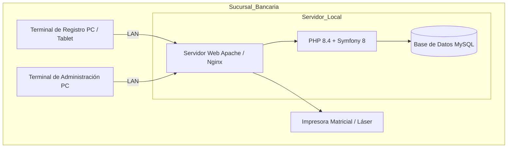
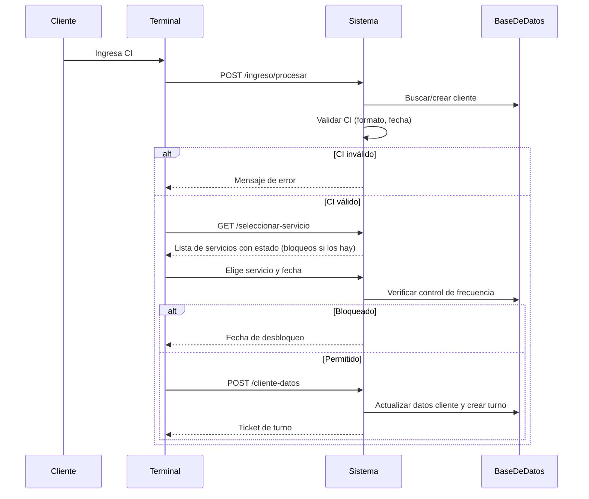

SGR-Turnos is structured as a classic Symfony MVC application augmented by an explicit service layer. Controllers stay thin: they validate HTTP input, delegate all business logic to injected service interfaces, and pass results to Twig templates. Doctrine repositories encapsulate all database queries. Symfony Voters enforce fine-grained access control per object. The entire stack runs on-premises inside a bank branch LAN — no internet connectivity is required.

---

## Deployment Architecture

All components run on a single local server. Registration terminals and the administration terminal connect over the branch LAN. The printer receives print jobs directly from the web server via browser CSS `@media print` — no dedicated print server is needed.



<Note>
  Because the system operates entirely offline, all assets (CSS, JavaScript, icons) are compiled and served locally. There is no CDN dependency. Node.js is only required if you wish to recompile the Tailwind CSS output; the compiled stylesheet is committed to the repository.
</Note>

---

## Directory Structure

The `src/` directory is organised into focused namespaces. Each namespace has a single responsibility, making it straightforward to locate and extend any part of the system.

<CardGroup cols={2}>
  <Card title="src/Command/" icon="terminal">
    Symfony console commands executed via `php bin/console`. Includes `app:create-super-admin` (interactive wizard to bootstrap the first administrator) and `app:load-roles` (seeds the four predefined roles into the database).
  </Card>
  <Card title="src/Controller/" icon="globe">
    HTTP controllers grouped into three sub-namespaces: `Admin/` for the back-office, `Security/` for login/logout, and public controllers for the client-facing registration terminal. Controllers are deliberately thin — no business logic lives here.
  </Card>
  <Card title="src/Doctrine/" icon="database">
    Contains `RetryableTransactionTrait`, a reusable trait that wraps critical database operations in a retry loop. It handles Doctrine `OptimisticLockException` and deadlock scenarios that can arise when multiple terminals compete for the same `ConfiguracionDiaria` row.
  </Card>
  <Card title="src/DTO/" icon="arrow-right-arrow-left">
    Data Transfer Objects carry validated form data from controllers into service methods. `ConfiguracionDiariaDTO` is the primary example: it holds `montoCargado`, `limitePorPersona`, `porcentajeReserva`, and `estado` as typed scalar properties.
  </Card>
  <Card title="src/Entity/" icon="table">
    Doctrine ORM entities representing the database schema: `Usuario`, `Rol`, `Cliente`, `Servicio`, `ConfiguracionDiaria`, `Turno`, and `Auditoria`. See the [Entities reference](/reference/entities) for full field documentation.
  </Card>
  <Card title="src/Enum/" icon="list">
    PHP 8.1 backed string enums: `EstadoTurno` and `EstadoConfiguracion`. See the [Enumerations reference](/reference/enums) for values, labels, and transition rules.
  </Card>
  <Card title="src/EventSubscriber/" icon="bolt">
    Symfony event subscribers that hook into the security lifecycle. The login subscriber updates `Usuario::$ultimoAcceso` on successful authentication. The logout subscriber may record an audit event.
  </Card>
  <Card title="src/Repository/" icon="magnifying-glass">
    Doctrine repository classes, one per entity. Repositories encapsulate all DQL/SQL queries. Notable methods include `TurnoRepository::findUltimoTurnoReservadoOUsado()` (used by `FrecuenciaService`) and `ConfiguracionDiariaRepository::findActivaByServicioYFecha()` (used by `DashboardService`).
  </Card>
  <Card title="src/Security/Voter/" icon="shield">
    Symfony Voters implement attribute-based access control at object level. Separate voters exist for `Turno` (e.g. whether the current user may cancel a specific turn) and `Usuario` (e.g. whether an admin may deactivate a peer). Controllers call `$this->denyAccessUnlessGranted()` and let the voter resolve the decision.
  </Card>
  <Card title="src/Service/" icon="gear">
    Business logic services, each backed by an interface. The service layer is the single source of truth for rules such as frequency blocking, ticket calculation, and audit recording. See the [Services reference](/reference/services) for interface documentation.
  </Card>
</CardGroup>

The full tree from the repository root:

```
sgr-turnos/
├── config/                 # Symfony configuration (services, security, packages)
├── migrations/             # Doctrine database migrations
├── public/                 # Web root — index.php and compiled assets
├── src/
│   ├── Command/            # Console commands (create-super-admin, load-roles)
│   ├── Controller/         # HTTP controllers (Admin/, Security/, public)
│   ├── Doctrine/           # RetryableTransactionTrait
│   ├── DTO/                # Data Transfer Objects
│   ├── Entity/             # Doctrine ORM entities
│   ├── Enum/               # PHP backed enums
│   ├── EventSubscriber/    # Login / logout event subscribers
│   ├── Repository/         # Doctrine repositories
│   ├── Security/Voter/     # Granular authorisation voters
│   └── Service/            # Business logic with interfaces
├── templates/              # Twig templates (admin/, public/, components/)
├── translations/           # i18n files (in development)
└── var/                    # Cache and logs (git-ignored)
```

---

## Client Registration Flow

The sequence below traces the path of a client from entering their identity number to receiving a printed ticket.



---

## Key Architectural Patterns

### Interface-backed services

Every service class implements a corresponding PHP interface. This makes the dependency injectable (Symfony's autowiring resolves the concrete class) and testable in isolation. The interface is the public contract; the concrete class is an implementation detail.

```php
// Injecting the interface — the container resolves ClienteManager automatically
public function __construct(private readonly ClienteInterface $clienteService) {}
```

### Optimistic locking with retry

`ConfiguracionDiaria` carries a `@Version` field managed by Doctrine. When two terminals try to assign a turn simultaneously, one will receive an `OptimisticLockException`. The `RetryableTransactionTrait` catches this exception and retries the transaction up to a configured limit, ensuring no ticket is double-issued.

### Voter-based authorisation

Rather than hardcoding role checks in controllers, the application uses Symfony Voters. A voter receives the action attribute (e.g. `TURNO_CANCEL`) and the subject entity, then returns `ACCESS_GRANTED` or `ACCESS_DENIED` based on the current user's role and ownership rules. This keeps authorisation logic cohesive and auditable.

### Append-only audit log

`AuditoriaService` is called at every significant state change. It never modifies existing records — each call creates a new `Auditoria` row with a before/after JSON snapshot. IP addresses are anonymised before storage using HMAC-SHA256 keyed on `APP_SECRET`, ensuring GDPR-compatible logging.

### Technology stack summary

| Layer | Technology |
|---|---|
| Backend | PHP 8.4, Symfony 8 |
| ORM / Database | Doctrine ORM, MySQL 8.0 / MariaDB 10.5+ |
| Templates | Twig |
| Styles | Tailwind CSS 3.4 |
| Security | CSRF tokens, Rate Limiting, bcrypt/Argon2, Voters |
| Audit | Custom service with HMAC-SHA256 IP anonymisation |
| Export | PhpSpreadsheet (Excel) |
| Print | CSS `@media print` |
| Deployment | Apache or Nginx; fully offline LAN |
