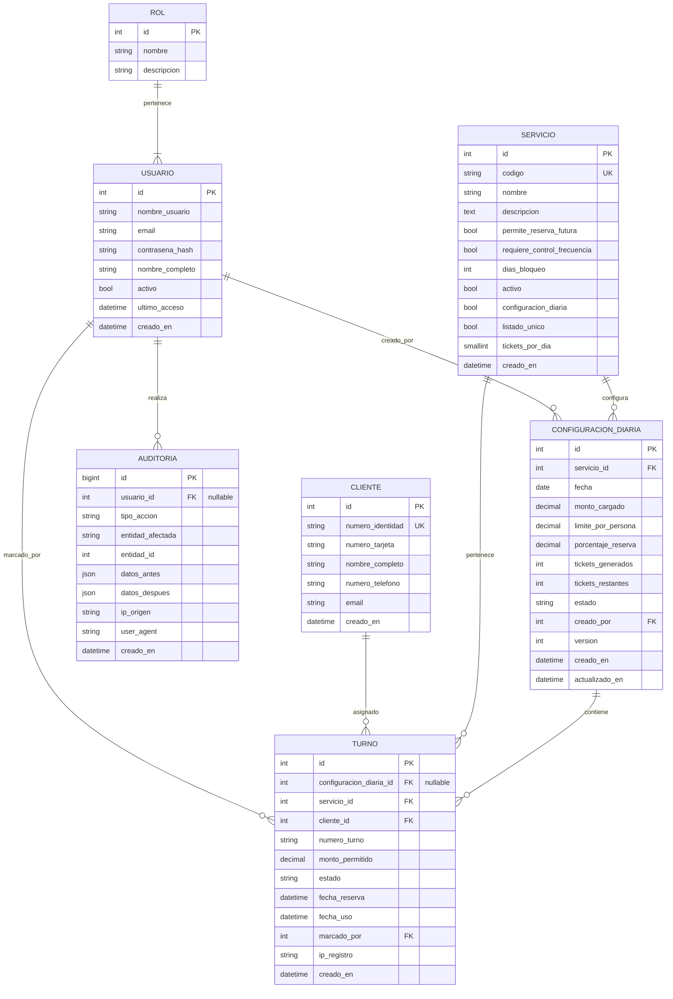

SGR-Turnos maps its domain onto seven Doctrine ORM entities stored in a MySQL 8.0 database. Each entity uses PHP 8 attributes for mapping metadata, unsigned integer primary keys generated automatically, and `datetime` columns initialised in the constructor. The ER diagram below shows how the entities relate before the per-entity field tables.

---

## Usuario

The `Usuario` entity represents a back-office operator. It implements Symfony's `UserInterface` and `PasswordAuthenticatedUserInterface`, so it integrates directly with the security layer. The user identifier is `nombre_usuario`; roles are derived at runtime from the associated `Rol` entity.

<Note>
  The `nombre_usuario` and `email` columns each carry a unique constraint (`uk_usuario_nombre_usuario`, `uk_usuario_email`). Duplicate values are rejected at the database level.
</Note>

<ResponseField name="id" type="int (unsigned)" required>
  Auto-generated primary key.
</ResponseField>

<ResponseField name="nombre_usuario" type="string(50)" required>
  Unique login handle used as the Symfony user identifier. Must follow the `ROLE_*` convention when referenced internally.
</ResponseField>

<ResponseField name="email" type="string(180)">
  Optional email address. Subject to a unique constraint when provided.
</ResponseField>

<ResponseField name="contrasena_hash" type="string(255)" required>
  Bcrypt or Argon2 password hash. Never stored in plain text. Returned by `getPassword()` for Symfony's password hasher.
</ResponseField>

<ResponseField name="nombre_completo" type="string(100)" required>
  Display name shown in the administration interface.
</ResponseField>

<ResponseField name="activo" type="bool" required>
  Soft-disable flag. Defaults to `true`. Inactive users are denied access without deleting their audit history.
</ResponseField>

<ResponseField name="ultimo_acceso" type="datetime">
  Timestamp updated by the login event subscriber on each successful authentication. Nullable until the first login.
</ResponseField>

<ResponseField name="creado_en" type="datetime" required>
  Set automatically to `new \DateTime()` in the constructor.
</ResponseField>

<ResponseField name="actualizado_en" type="datetime">
  Nullable. Updated by the application whenever profile data changes.
</ResponseField>

<ResponseField name="rol" type="ManyToOne → Rol" required>
  Non-nullable foreign key to the `Rol` entity (`rol_id`). Drives the value returned by `getRoles()`.
</ResponseField>

---

## Rol

The `Rol` entity holds the named roles loaded via `php bin/console app:load-roles`. Role names **must** include the `ROLE_` prefix (e.g. `ROLE_ADMIN`, `ROLE_OPERADOR`) so they are accepted directly by Symfony's access-control layer.

<Warning>
  The `nombre` column carries a unique constraint (`uk_rol_nombre`). Attempting to insert a duplicate role name raises a database integrity error.
</Warning>

<ResponseField name="id" type="int (unsigned)" required>
  Auto-generated primary key.
</ResponseField>

<ResponseField name="nombre" type="string(50)" required>
  Unique role identifier string. Must be prefixed with `ROLE_`.
</ResponseField>

<ResponseField name="descripcion" type="string(255)">
  Human-readable description of the role's permissions. Nullable.
</ResponseField>

<ResponseField name="creado_en" type="datetime" required>
  Set automatically to `new \DateTime()` in the constructor.
</ResponseField>

---

## Cliente

The `Cliente` entity represents a bank customer identified by their Cuban national identity number (CI). The system creates or retrieves a `Cliente` record at registration time; personal data may be updated on subsequent visits.

<Note>
  `numero_identidad` carries a unique constraint (`uk_cliente_numero_identidad`). `numero_tarjeta` has an index (`idx_cliente_numero_tarjeta`) for fast lookups but is not unique.
</Note>

<ResponseField name="id" type="int (unsigned)" required>
  Auto-generated primary key.
</ResponseField>

<ResponseField name="numero_identidad" type="string(20)" required>
  Cuban identity document number. Subject to format and birthdate validation before being persisted. Enforces the unique constraint.
</ResponseField>

<ResponseField name="numero_tarjeta" type="string(20)">
  Bank card number. Optional; indexed for search but not unique.
</ResponseField>

<ResponseField name="nombre_completo" type="string(150)">
  Full name as provided by the client at registration. Nullable; may be populated or updated later.
</ResponseField>

<ResponseField name="numero_telefono" type="string(20)">
  Contact phone number. Nullable.
</ResponseField>

<ResponseField name="email" type="string(180)">
  Contact email address. Nullable.
</ResponseField>

<ResponseField name="creado_en" type="datetime" required>
  Set automatically to `new \DateTime()` in the constructor.
</ResponseField>

<ResponseField name="actualizado_en" type="datetime">
  Nullable. Updated each time the client's contact data is modified.
</ResponseField>

---

## Servicio

A `Servicio` defines a service type (e.g. ATM withdrawal, teller window) and its operational rules. The combination of `configuracion_diaria` and `listado_unico` flags controls which ticketing mode applies for a given service.

<Tip>
  When `configuracion_diaria` is `true`, daily capacity is governed by a linked `ConfiguracionDiaria` record. When `listado_unico` is `true`, a single shared sequence is used across the service without daily partitioning.
</Tip>

<ResponseField name="id" type="int (unsigned)" required>
  Auto-generated primary key.
</ResponseField>

<ResponseField name="codigo" type="string(20)" required>
  Short unique code identifying the service (`uk_servicio_codigo`). Used in URLs and printed tickets.
</ResponseField>

<ResponseField name="nombre" type="string(100)" required>
  Human-readable service name displayed to clients and administrators.
</ResponseField>

<ResponseField name="descripcion" type="string(255)">
  Optional description of the service. Nullable.
</ResponseField>

<ResponseField name="permite_reserva_futura" type="bool" required>
  When `true`, clients may reserve a turn for a future date. Defaults to `true`.
</ResponseField>

<ResponseField name="requiere_control_frecuencia" type="bool" required>
  When `true`, the frequency-blocking logic (anti-colero) is enforced. Defaults to `true`.
</ResponseField>

<ResponseField name="dias_bloqueo" type="smallint (unsigned)">
  Number of days a client is blocked after a successful use. Defaults to `7`. Only relevant when `requiere_control_frecuencia` is `true`.
</ResponseField>

<ResponseField name="activo" type="bool" required>
  Soft-disable flag. Inactive services are hidden from the public registration terminal. Defaults to `true`.
</ResponseField>

<ResponseField name="configuracion_diaria" type="bool" required>
  When `true`, daily configurations (`ConfiguracionDiaria`) govern capacity. Defaults to `true`.
</ResponseField>

<ResponseField name="listado_unico" type="bool" required>
  When `true`, the service uses a single global turn list rather than per-day partitioning. Defaults to `false`.
</ResponseField>

<ResponseField name="tickets_por_dia" type="smallint (unsigned)">
  Maximum tickets available per day for services that do not use `ConfiguracionDiaria`. Nullable.
</ResponseField>

<ResponseField name="creado_en" type="datetime" required>
  Set automatically to `new \DateTime()` in the constructor.
</ResponseField>

<ResponseField name="actualizado_en" type="datetime">
  Nullable. Updated by the application on service configuration changes.
</ResponseField>

---

## ConfiguracionDiaria

A `ConfiguracionDiaria` record defines the capacity parameters for a specific service on a specific date. The pair `(servicio_id, fecha)` is unique (`uk_configuracion_diaria_servicio_fecha`). Doctrine's `@Version` field enables optimistic locking to prevent concurrent overwrites during high-load turn assignment.

<Warning>
  `decrementarTicketsRestantes()` raises `NoTicketsDisponiblesException` if the requested decrement exceeds `tickets_restantes`. Always call it inside a transaction with optimistic locking active.
</Warning>

<ResponseField name="id" type="int (unsigned)" required>
  Auto-generated primary key.
</ResponseField>

<ResponseField name="servicio_id" type="ManyToOne → Servicio" required>
  Non-nullable foreign key to the parent `Servicio`. Part of the unique index with `fecha`.
</ResponseField>

<ResponseField name="fecha" type="date" required>
  The calendar date this configuration applies to. Part of the unique index with `servicio_id`.
</ResponseField>

<ResponseField name="monto_cargado" type="decimal(12,2)" required>
  Total cash amount loaded into the ATM or prepared for the teller on this date.
</ResponseField>

<ResponseField name="limite_por_persona" type="decimal(10,2)" required>
  Maximum amount a single client may withdraw. Used together with `monto_cargado` and `porcentaje_reserva` to compute `tickets_generados`.
</ResponseField>

<ResponseField name="porcentaje_reserva" type="decimal(5,2)" required>
  Percentage of `monto_cargado` reserved and not allocated to public tickets. Defaults to `0.00`. Computed with BCMath for exact precision.
</ResponseField>

<ResponseField name="tickets_generados" type="int (unsigned)" required>
  Total tickets available for the day, calculated as `floor(monto_cargado * (1 - porcentaje_reserva/100) / limite_por_persona)`.
</ResponseField>

<ResponseField name="tickets_restantes" type="int (unsigned)" required>
  Running count of tickets not yet assigned. Decremented atomically when a `Turno` is created.
</ResponseField>

<ResponseField name="estado" type="EstadoConfiguracion enum" required>
  Current lifecycle state of the configuration. See the [Enumerations reference](/reference/enums) for valid values and transitions.
</ResponseField>

<ResponseField name="creado_por" type="ManyToOne → Usuario">
  Nullable foreign key to the `Usuario` who created the configuration record.
</ResponseField>

<ResponseField name="version" type="int" required>
  Doctrine optimistic-lock version counter. Incremented automatically on every `UPDATE`. Starts at `1`.
</ResponseField>

<ResponseField name="creado_en" type="datetime" required>
  Set automatically to `new \DateTime()` in the constructor.
</ResponseField>

<ResponseField name="actualizado_en" type="datetime">
  Nullable. Explicitly set by `ConfiguracionDiariaManager::crearOActualizar()` on each update.
</ResponseField>

---

## Turno

A `Turno` is a single queuing reservation binding a `Cliente` to a `Servicio` on a given date. Two unique constraints prevent duplicate assignments: `uk_turno_configuracion_numero` (`configuracion_diaria_id`, `numero_turno`) and `uk_turno_configuracion_cliente` (`configuracion_diaria_id`, `cliente_id`). An index on `(cliente_id, estado, fecha_uso)` accelerates frequency-block queries.

<Note>
  `configuracion_diaria_id` is nullable. Turns belonging to a **Listado Único** service are not linked to any `ConfiguracionDiaria`, but they still reference a `Servicio` directly via `servicio_id`.
</Note>

<ResponseField name="id" type="int (unsigned)" required>
  Auto-generated primary key.
</ResponseField>

<ResponseField name="configuracion_diaria_id" type="ManyToOne → ConfiguracionDiaria">
  Nullable foreign key. `null` for Listado Único services that have no daily capacity configuration.
</ResponseField>

<ResponseField name="servicio_id" type="ManyToOne → Servicio" required>
  Non-nullable foreign key. Set automatically when `setConfiguracionDiaria()` is called with a non-null argument.
</ResponseField>

<ResponseField name="cliente_id" type="ManyToOne → Cliente" required>
  Non-nullable foreign key to the registered client.
</ResponseField>

<ResponseField name="numero_turno" type="string(10)" required>
  Unique sequential turn number within a configuration or service. Generated during turn creation.
</ResponseField>

<ResponseField name="monto_permitido" type="decimal(10,2)" required>
  The withdrawal amount authorised for this specific turn, drawn from the configuration's `limite_por_persona`.
</ResponseField>

<ResponseField name="estado" type="EstadoTurno enum" required>
  Current state of the turn. Defaults to `RESERVADO`. See the [Enumerations reference](/reference/enums).
</ResponseField>

<ResponseField name="fecha_reserva" type="datetime" required>
  Timestamp of when the reservation was created. Set automatically to `new \DateTime()` in the constructor.
</ResponseField>

<ResponseField name="fecha_uso" type="datetime">
  Timestamp populated by `marcarComoUsado()` when a custodian marks the turn as used. Nullable until that point.
</ResponseField>

<ResponseField name="marcado_por" type="ManyToOne → Usuario">
  Nullable foreign key to the `Usuario` who marked the turn as used.
</ResponseField>

<ResponseField name="ip_registro" type="string(45)">
  Anonymised IP address of the terminal that created the reservation. Stores the output of `IpAnonymizerService::anonymize()`.
</ResponseField>

<ResponseField name="observaciones" type="string(255)">
  Free-text notes. Nullable.
</ResponseField>

---

## Auditoria

The `Auditoria` entity stores an immutable log of every significant action performed in the system. It uses a `bigint` primary key to accommodate high-volume write scenarios. The `usuario_id` foreign key is nullable so that public-terminal actions (performed without authentication) are still recorded.

<Warning>
  Audit records are append-only. The application never updates or deletes rows in this table. `ip_origen` always contains an HMAC-SHA256 hash or a partial-mask of the original IP — never the raw address.
</Warning>

<ResponseField name="id" type="bigint (unsigned)" required>
  Auto-generated primary key. `bigint` to support long-running production deployments.
</ResponseField>

<ResponseField name="usuario_id" type="ManyToOne → Usuario">
  Nullable foreign key. `null` when the action was performed by an unauthenticated public-terminal user.
</ResponseField>

<ResponseField name="tipo_accion" type="string(50)" required>
  Short action code (e.g. `CREAR_TURNO`, `CANCELAR_TURNO`, `LOGIN`). Free-form string set by the caller of `AuditoriaService::registrar()`.
</ResponseField>

<ResponseField name="entidad_afectada" type="string(50)">
  Entity class name or table identifier that was modified (e.g. `Turno`, `ConfiguracionDiaria`). Nullable.
</ResponseField>

<ResponseField name="entidad_id" type="int (unsigned)">
  Primary key value of the affected entity row. Nullable when the action does not target a single record.
</ResponseField>

<ResponseField name="datos_antes" type="json">
  Snapshot of the entity state before the change. Nullable for creation events. Stored as a PHP array serialised to JSON.
</ResponseField>

<ResponseField name="datos_despues" type="json">
  Snapshot of the entity state after the change. Nullable for deletion events.
</ResponseField>

<ResponseField name="ip_origen" type="string(64)">
  Anonymised client IP address produced by `IpAnonymizerService`. Maximum 64 characters to accommodate HMAC-SHA256 hex output.
</ResponseField>

<ResponseField name="user_agent" type="string(255)">
  Raw `User-Agent` header value from the HTTP request. Nullable.
</ResponseField>

<ResponseField name="creado_en" type="datetime" required>
  Set automatically to `new \DateTime()` in the constructor. Immutable after insertion.
</ResponseField>
