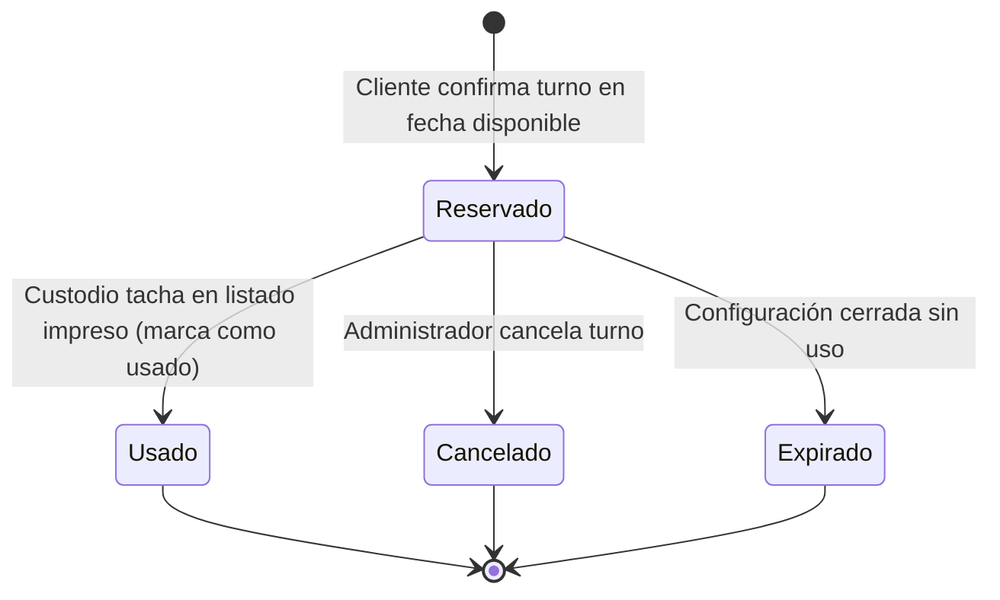

SGR-Turnos encodes its core lifecycle concepts as PHP 8.1 backed string enums. Using backed enums lets Doctrine map the values directly to `VARCHAR` columns with the `enumType` option, while the `getLabel()` method provides a Spanish display string for the UI. There are two enums: `EstadoTurno` models the lifecycle of a single reservation, and `EstadoConfiguracion` models the lifecycle of a daily service configuration.

---

## EstadoTurno

`EstadoTurno` tracks every state a `Turno` entity can occupy from the moment a client reserves it through to its final resolution. The database column is `VARCHAR(20)` and stores the enum's raw string value.

```php
<?php

namespace App\Enum;

enum EstadoTurno: string
{
    case RESERVADO = 'RESERVADO';
    case USADO     = 'USADO';
    case CANCELADO = 'CANCELADO';
    case CADUCADO  = 'CADUCADO';
    case EXPIRADO  = 'EXPIRADO';

    public function getLabel(): string
    {
        return match($this) {
            self::RESERVADO => 'Reservado',
            self::USADO     => 'Usado',
            self::CANCELADO => 'Cancelado',
            self::CADUCADO  => 'Caducado',
            self::EXPIRADO  => 'Expirado',
        };
    }
}
```

### Case Reference

<ResponseField name="RESERVADO" type="string = 'RESERVADO'">
  **Label:** Reservado

  The initial state assigned when a client successfully completes the reservation flow. The turn is visible on the printed daily list and counts against `tickets_restantes` in the linked `ConfiguracionDiaria`.
</ResponseField>

<ResponseField name="USADO" type="string = 'USADO'">
  **Label:** Usado

  Set by `Turno::marcarComoUsado(Usuario $usuario)`. Populated alongside `fecha_uso` and `marcado_por`. Marking a turn as used activates the frequency-blocking period for the client: the `FrecuenciaService` will return a non-null `fechaDesbloqueo` until `dias_bloqueo` days have elapsed.
</ResponseField>

<ResponseField name="CANCELADO" type="string = 'CANCELADO'">
  **Label:** Cancelado

  Set by `Turno::cancelar()`. Used when an administrator explicitly voids a reservation before it is used. Cancellation does **not** decrement the frequency block counter and does **not** restore `tickets_restantes` automatically — this is handled at the service layer.
</ResponseField>

<ResponseField name="CADUCADO" type="string = 'CADUCADO'">
  **Label:** Caducado

  Reserved for turns that lapse due to inactivity or a time-based rule not yet handled by the automated close flow. Defined in the enum but distinct from `EXPIRADO` to allow future differentiation of lapse causes.
</ResponseField>

<ResponseField name="EXPIRADO" type="string = 'EXPIRADO'">
  **Label:** Expirado

  Set by `Turno::expirar()`. Applied in bulk when a `ConfiguracionDiaria` transitions to `FINALIZADA` and `RESERVADO` turns still remain — the service was closed for the day before those clients arrived. Expiry does not activate a frequency block.
</ResponseField>

### Transition Rules

The table below summarises which transitions are valid and who may trigger them.

| From | To | Trigger | Actor |
|---|---|---|---|
| `RESERVADO` | `USADO` | `Turno::marcarComoUsado()` | Supervisor / Operador marking the printed list |
| `RESERVADO` | `CANCELADO` | `Turno::cancelar()` | Admin or authorised Voter |
| `RESERVADO` | `EXPIRADO` | `Turno::expirar()` (bulk) | System / Admin closing `ConfiguracionDiaria` |
| `RESERVADO` | `CADUCADO` | Application logic (future) | System |

<Warning>
  Once a turn leaves `RESERVADO` it is in a terminal state. None of `USADO`, `CANCELADO`, `CADUCADO`, or `EXPIRADO` may transition to any other state. There is no "undo" path in the current implementation.
</Warning>

The README turn lifecycle diagram is reproduced below for quick reference:



---

## EstadoConfiguracion

`EstadoConfiguracion` tracks the operational state of a `ConfiguracionDiaria` record throughout the business day. The column is also `VARCHAR(20)` using the `enumType` option. The default value when a new configuration is created is `ABIERTA`.

```php
<?php

namespace App\Enum;

enum EstadoConfiguracion: string
{
    case ABIERTA    = 'ABIERTA';
    case CERRADA    = 'CERRADA';
    case FINALIZADA = 'FINALIZADA';

    public function getLabel(): string
    {
        return match($this) {
            self::ABIERTA    => 'Abierta',
            self::CERRADA    => 'Cerrada',
            self::FINALIZADA => 'Finalizada',
        };
    }
}
```

### Case Reference

<ResponseField name="ABIERTA" type="string = 'ABIERTA'">
  **Label:** Abierta

  The configuration is accepting new reservations. `tickets_restantes` is greater than zero and the public registration terminal will offer this service/date combination to clients. This is the default state set in `ConfiguracionDiaria::$estado`.
</ResponseField>

<ResponseField name="CERRADA" type="string = 'CERRADA'">
  **Label:** Cerrada

  No new reservations are accepted. Existing `RESERVADO` turns are still valid and have not yet been finalised. An administrator sets this state at the end of the registration window (e.g. when `tickets_restantes` reaches zero, or manually before the start of the service day).
</ResponseField>

<ResponseField name="FINALIZADA" type="string = 'FINALIZADA'">
  **Label:** Finalizada

  The day is complete. The system transitions the configuration to `FINALIZADA` after the close-of-day process, which also bulk-expires any remaining `RESERVADO` turns via `Turno::expirar()`. No further state changes are expected after this point.
</ResponseField>

### Transition Rules

| From | To | Trigger | Actor |
|---|---|---|---|
| `ABIERTA` | `CERRADA` | Manual state change or `tickets_restantes = 0` | Admin / Supervisor |
| `CERRADA` | `FINALIZADA` | End-of-day close procedure (bulk expiry of turns) | Admin |
| `ABIERTA` | `FINALIZADA` | Direct close (skipping `CERRADA`) | Admin |

<Note>
  The transition to `FINALIZADA` is the point at which any `RESERVADO` turns that have not been marked `USADO` are set to `EXPIRADO`. Ensure all custodian markings are recorded before triggering finalisation.
</Note>

<Tip>
  `ConfiguracionDiariaManager::crearOActualizar()` accepts any `EstadoConfiguracion` value via the `ConfiguracionDiariaDTO`. Administrators can therefore re-open a `CERRADA` configuration by passing `ABIERTA` again, provided the capacity arithmetic remains valid.
</Tip>
